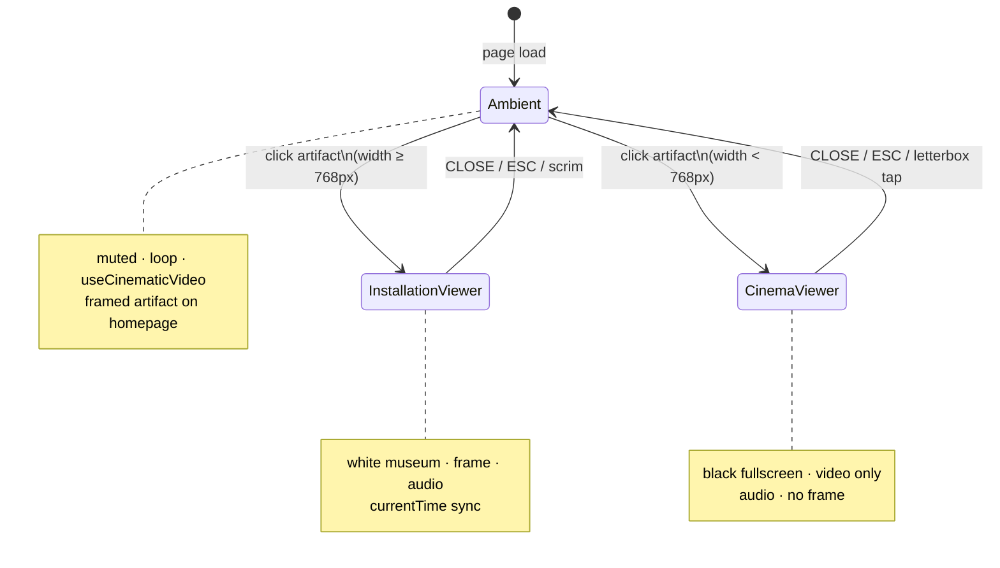

# Showreel System

**Status:** OPERATIONAL — homepage `/` section  
**System:** `sections/ShowreelSection/`  
**Route anchor:** `#showreel`

**Homepage position:** after Brand Identity (`#identity`), before Contact Footer.

```
Hero → Work → Archive Fragment → Brand Identity → Showreel → Contact Footer
```

---

## 1. Architecture

The showreel is a three-state system: **ambient** (always on the homepage), **desktop installation viewer**, and **mobile cinema viewer**. Platform choice is made once at open time via `(max-width: 767px)` — aligned with Tailwind `md` (768px).

### File ownership

| File | Role |
|------|------|
| `sections/ShowreelSection/index.tsx` | Section shell — `SectionLabel`, spacing, year annotation |
| `sections/ShowreelSection/ShowreelMediaCard.tsx` | Ambient artifact, open/close orchestration, time sync |
| `sections/ShowreelSection/ShowreelInstallationViewer.tsx` | Desktop installation viewer (≥768px) |
| `sections/ShowreelSection/ShowreelCinemaViewer.tsx` | Mobile cinema viewer (<768px) |
| `public/frames/showreel_frame.png` | Metallic frame overlay (local, not R2) |
| `systems/useCinematicVideo.ts` | Ambient viewport-gated playback |
| `content/archiveObjectPaths.ts` → `resolveArchiveMediaSrc()` | R2 / origin transport for video |

Frame geometry and compositing doctrine → `docs/SHOWREEL_FRAME_CALIBRATION.md`.

---

### Ambient state (State A)

**Purpose:** Homepage artifact — muted, cinematic, non-blocking.

| Behavior | Implementation |
|----------|----------------|
| Muted autoplay | `useCinematicVideo` — `muted: true`, `loop`, `playsInline` |
| Viewport-aware load/play | `IntersectionObserver` — `preload="none"` until intersecting; pauses off-screen |
| Gesture unlock | One-shot `click` / `scroll` / `touchstart` on document if autoplay blocked |
| Fade-in | `opacity-0` → `opacity-100` on `loadedData` |
| Frame stack | Video in calibrated aperture + vignette mask + `showreel_frame.png` with silhouette shadows |
| Card motion | `oni-showreel-float` (md+, reduced-motion safe); fine-pointer parallax; hover `scale-[1.012]` |
| Open trigger | Whole artifact is a `<button>` — opens viewer unless export mode |
| R2 source | `SHOWREEL_VIDEO_PATH` resolved through `resolveArchiveMediaSrc()` |

**Export mode:** `useExportMode()` disables viewer open and parallax — ambient card only.

---

### Desktop viewer — installation mode (≥768px)

**Purpose:** Museum installation — white field, framed artifact, site remains perceptually present.

| Behavior | Implementation |
|----------|----------------|
| Open | Click ambient artifact → `viewerKind: "installation"` |
| Field | `fixed inset-0 z-30` — `bg-white/96` + `backdrop-blur-[2px]` scrim |
| Artifact | Same frame stack as ambient at `max-w-[min(92vw,1100px)]` |
| Audio | Viewer `<video>` unmuted on open |
| Time sync | `currentTime` copied from ambient on open; written back to ambient on close |
| Ambient while open | Ambient video paused |
| Close | **CLOSE** button, **ESC**, pointer-down on scrim (outside artifact) |
| A11y | `role="dialog"`, focus trap, scroll lock on `body`, focus return to trigger |
| Motion | Opacity + `scale-[0.98→1]`; `motion-reduce:` opacity only (~700ms) |

Component: `ShowreelInstallationViewer.tsx`.

---

### Mobile viewer — cinema mode (<768px)

**Purpose:** Dedicated fullscreen cinema — black field, video only; no frame, no site chrome.

| Behavior | Implementation |
|----------|----------------|
| Open | Click ambient artifact → `viewerKind: "cinema"` |
| Layer | Portaled to `document.body` via `createPortal` — escapes section `overflow-hidden` |
| Stacking | `z-[60]` — above navigation (`z-40` / `z-50` overlay) |
| Field | `fixed inset-0`, `h-[100dvh]` — solid `bg-black` |
| Presentation | Centered `<video>` — `object-contain`; layout box matches picture, letterbox is background |
| Audio | Unmuted on open |
| Time sync | Same `syncTime` / `onTimeSync` contract as installation viewer |
| Close | **CLOSE** (fixed, safe-area), **ESC**, tap on **black letterbox** (full-screen backdrop behind video) |
| Video tap | Does **not** close — `stopPropagation` on video pointer/click |
| Scroll lock | `html` + `body` overflow hidden; `body` `position: fixed` with scroll position restore; `touchmove` prevented on `document` (`passive: false`) |
| Touch | `touch-none` + `overscroll-none` on cinema root |

Component: `ShowreelCinemaViewer.tsx`.

**Design intent:** Desktop = installation (museum, site visible). Mobile = cinema (isolated takeover).

---

## 2. Media pipeline

### Current source

| Item | Value |
|------|--------|
| Transport path (code) | `/showreel/gg2.mp4` |
| Constant | `SHOWREEL_VIDEO_PATH` in `ShowreelMediaCard.tsx` |
| CDN / R2 | Served via `NEXT_PUBLIC_ARCHIVE_MEDIA_ORIGIN` when set |
| Local fallback | Same path under site origin if env unset |

Video is **not** stored in `public/`. Do not add showreel masters under `public/archive/`.

### How to replace media

Future swaps should require **only** a new file on R2 and a path constant update (plus verification). Frame changes are a separate workflow — see `SHOWREEL_FRAME_CALIBRATION.md`.

1. **Upload** new MP4 to R2 at the chosen key (e.g. `/showreel/gg3.mp4`).
   - Preserve audio (do not strip with `-an`).
   - Prefer H.264 + AAC, `playsInline`-friendly encoding.
2. **Update source path** — change `SHOWREEL_VIDEO_PATH` in `ShowreelMediaCard.tsx` (single constant; viewers inherit `showreelSrc`).
3. **Verify ambient** — scroll showreel into view; confirm muted loop, fade-in, viewport pause/resume.
4. **Verify desktop viewer** — at ≥768px width: white field, frame alignment, unmuted audio, time resumes on close.
5. **Verify mobile viewer** — at <768px (or DevTools): black fullscreen, no frame, unmuted audio, CLOSE + ESC.
6. **Deploy** — ensure `NEXT_PUBLIC_ARCHIVE_MEDIA_ORIGIN` points at the bucket serving the new object; rebuild Pages.

Optional: update year annotation in `ShowreelSection/index.tsx` if editorially required — not required for a pure media swap.

---

## 3. State diagram



ASCII equivalent:

```
                    ┌─────────────────────┐
                    │   Ambient (home)    │
                    │ muted · framed card │
                    └──────────┬──────────┘
                               │ click
              ┌────────────────┴────────────────┐
              │                                 │
     viewport ≥ 768px                  viewport < 768px
              │                                 │
              ▼                                 ▼
   ┌──────────────────────┐        ┌──────────────────────┐
   │ Installation Viewer  │        │   Cinema Viewer      │
   │ white · frame · blur │        │ black · video only   │
   └──────────┬───────────┘        └──────────┬───────────┘
              │ CLOSE / ESC / scrim           │ CLOSE / ESC / letterbox
              └────────────────┬──────────────┘
                               ▼
                    ┌─────────────────────┐
                    │   Ambient (resume)  │
                    │ time + muted play   │
                    └─────────────────────┘
```

---

## 4. Troubleshooting

### Video not loading

| Check | Action |
|-------|--------|
| R2 object exists | Confirm key matches `SHOWREEL_VIDEO_PATH` (leading `/`) |
| `NEXT_PUBLIC_ARCHIVE_MEDIA_ORIGIN` | Must match bucket URL; no trailing slash issues — resolver strips trailing `/` |
| Network tab | Resolved URL should be `origin + /showreel/….mp4` |
| Ambient preload | Ambient uses `preload="none"` until intersecting — scroll section into view |
| CORS | R2 bucket must allow GET from site origin |

### Audio missing

| Context | Cause / fix |
|---------|-------------|
| Ambient | **Expected** — ambient is always muted |
| Desktop / mobile viewer | Viewer sets `muted = false` on open; user gesture satisfied by click-to-open |
| After close | Ambient resumes muted — expected |
| iOS low power | Autoplay policies may still block; user opened via tap — retry CLOSE and reopen |

### Viewer not opening

| Check | Action |
|-------|--------|
| Export mode | `useExportMode()` disables open — expected in export captures |
| JS errors | Inspect console on click |
| `pointer-events` | Viewer uses `pointer-events-none` when `isOpen={false}` — confirm state toggles |

### Mobile cinema: page scrolls or nav visible

| Check | Action |
|-------|--------|
| Stacking | Cinema must be portaled with `z-[60]` — not `z-30` inside a section |
| iOS scroll | Confirm `body` fixed lock + `touchmove` prevent runs while `isOpen` |
| Close lost | CLOSE is `z-[2]` above backdrop; letterbox taps hit backdrop `z-0` |

### `currentTime` not syncing

| Check | Action |
|-------|--------|
| Open path | `openViewer` reads `ambient.currentTime` before pause |
| Close path | `handleClose` / `handleTimeSync` must run — verify CLOSE and ESC call `handleClose` |
| Ambient resume | `handleTimeSync` sets `ambient.currentTime` and calls `play()` |

### R2 origin mismatch

| Symptom | Fix |
|---------|-----|
| 404 on video URL | Origin env points at wrong bucket or path prefix |
| Local dev works, prod fails | Production env missing or stale `NEXT_PUBLIC_ARCHIVE_MEDIA_ORIGIN` |
| Double slash | Resolver normalizes; path should start with `/` |

### Frame misalignment (desktop / ambient only)

Not a media-pipeline issue — see `SHOWREEL_FRAME_CALIBRATION.md`. Mobile cinema viewer has no frame.

---

## Z-index

| Viewer | z-index | Notes |
|--------|---------|--------|
| Installation (desktop) | `z-30` | Reserved in `ARCHITECTURE.md`; site nav remains above |
| Cinema (mobile) | `z-[60]` | Portaled takeover — must cover nav and menu overlay |

Cinema layer is mobile-only and documented here; it does not change the global z-index table for navigation.

---

## Related docs

- `docs/SHOWREEL_FRAME_CALIBRATION.md` — aperture constants, compositing, frame replacement
- `ARCHITECTURE.md` — `oni-showreel` token, section atmosphere, z-index table
- `AI_RULES.md` — cinematic video doctrine (grid vs showreel contexts)
